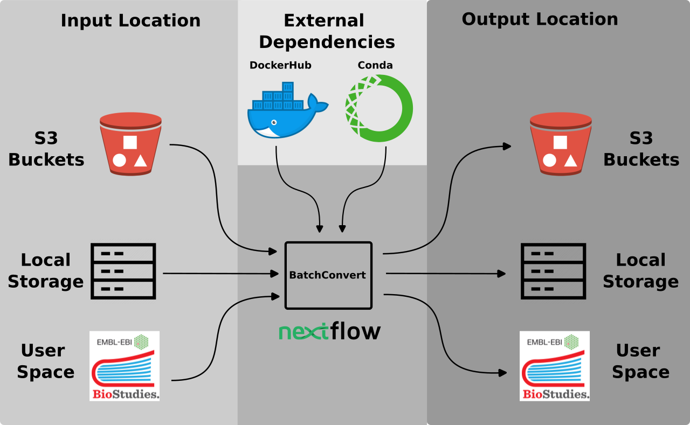

# BatchConvert

A command line tool for converting image data into either of the standard file formats OME-TIFF or OME-Zarr. 

The tool wraps the dedicated file converters bfconvert and bioformats2raw to convert into OME-TIFF or OME-Zarr,
respectively. The workflow management system NextFlow is used to perform conversion in parallel for batches of images. 

The tool also wraps s3 and Aspera clients (go-mc and aspera-cli, respectively). Therefore, input and output locations can 
be specified as local or remote storage and file transfer will be performed automatically. The conversion can be run on 
HPC with Slurm.  



## Installation & Dependencies

**Important** note: The package has been so far only tested on Ubuntu 20.04.

The minimal dependency to run the tool is NextFlow, which should be installed and made accessible from the command line.

If conda exists on your system, you can install BatchConvert together with NextFlow using the following script:
```
git clone https://github.com/Euro-BioImaging/BatchConvert.git && \ 
source BatchConvert/installation/install_with_nextflow.sh
```


If you already have NextFlow installed and accessible from the command line (or if you prefer to install it manually 
e.g., as shown [here](https://www.nextflow.io/docs/latest/getstarted.html)), you can also install BatchConvert alone, using the following script:
```
git clone https://github.com/Euro-BioImaging/BatchConvert.git && \ 
source BatchConvert/installation/install.sh
```


Other dependencies (which will be **automatically** installed):
- bioformats2raw (entrypoint bioformats2raw)
- bftools (entrypoint bfconvert)
- go-mc (entrypoint mc)
- aspera-cli (entrypoint ascp)

These dependencies will be pulled and cached automatically at the first execution of the conversion command. 
The mode of dependency management can  be specified by using the command line option ``--profile`` or `-pf`. Depending 
on how this option is specified, the dependencies will be acquired / run either via conda or via docker/singularity containers. 

Specifying ``--profile conda`` (default) will install the dependencies to an 
environment at ``./.condaCache`` and use this environment to run the workflow. This option 
requires that miniconda/anaconda is installed on your system.    

Alternatively, specifying ``--profile docker`` or ``--profile singularity`` will pull a docker or 
singularity image with the dependencies, respectively, and use this image to run the workflow.
These options assume that the respective container runtime (docker or singularity) is available on 
your system. If singularity is being used, a cache directory will be created at the path 
``./.singularityCache`` where the singularity image is stored. 

Finally, you can still choose to install the dependencies manually and use your own installations to run
the workflow. In this case, you should specify ``--profile standard`` and make sure the entrypoints
specified above are recognised by your shell.  


## Configuration

BatchConvert can be configured to have default options for file conversion and transfer. Probably, the most important sets of parameters
to be configured include credentials for the remote ends. The easiest way to configure remote stores is by running the interactive 
configuration command as indicated below.

### Configuration of the s3 object store

Run the interactive configuration command: 

`batchconvert configure_s3_remote`

This will start a sequence of requests for s3 credentials such as name, url, access, etc. Provide each requested credential and click
enter. Continue this cycle until the process is finished. Upon completing the configuration, the sequence of commands should roughly look like this:

```
oezdemir@pc-ellenberg108:~$ batchconvert configure_s3_remote
enter remote name (for example s3)
s3
enter url:
https://s3.embl.de
enter access key:
<your-access-key>
enter secret key:
<your-secret-key>
enter bucket name:
<your-bucket>
Configuration of the default s3 credentials is complete
```


### Configuration of the BioStudies user space

Run the interactive configuration command: 

`batchconvert configure_bia_remote`

This will prompt a request for the secret directory to connect to. Enter the secret directory for your user space and click enter. 
Upon completing the configuration, the sequence of commands should roughly look like this:

```
oezdemir@pc-ellenberg108:~$ batchconvert configure_bia_remote
enter the secret directory for BioImage Archive user space:
<your-secret-directory>
configuration of the default bia credentials is complete
```

### Configuration of the slurm options

BatchConvert can also run on slurm clusters. In order to configure the slurm parameters, run the interactive configuration command: 

`batchconvert configure_slurm`

This will start a sequence of requests for slurm options. Provide each requested option and click enter. 
Continue this cycle until the process is finished. Upon completing the configuration, the sequence of commands should 
roughly look like this:

```
oezdemir@pc-ellenberg108:~$ batchconvert configure_slurm
Please enter value for queue_size
Click enter if this parameter is not applicable
Enter "skip" or "s" if you would like to keep the current value ´50´
s
Please enter value for submit_rate_limit
Click enter if this parameter is not applicable
Enter "skip" or "s" if you would like to keep the current value ´10/2min´
s
Please enter value for cluster_options
Click enter if this parameter is not applicable
Enter "skip" or "s" if you would like to keep the current value ´--mem-per-cpu=3140 --cpus-per-task=16´
s
Please enter value for time
Click enter if this parameter is not applicable
Enter "skip" or "s" if you would like to keep the current value ´6h´
s
configuration of the default slurm parameters is complete
```

### Configuration of the default conversion parameters

While all conversion parameters can be specified as command line arguments, it can
be useful for the users to set their own default parameters to avoid re-entering those
parameters for subsequent executions. BatchConvert allows for interactive configuration of 
conversion in the same way as configuration of the remote stores described above.

To configure the conversion into OME-TIFF, run the following command:

`batchconvert configure_ometiff`

This will prompt the user to enter a series of parameters, which will then be saved as the 
default parameters to be passed to the `batchconvert ometiff` command. Upon completing the 
configuration, the sequence of commands should look similar to:

```
oezdemir@pc-ellenberg108:~$ batchconvert configure_ometiff
Please enter value for noflat
Click enter if this parameter is not applicable
Enter "skip" or "s" if you would like to keep the parameter´s current value, which is <bfconvert defaults>
s
Please enter value for series
Click enter if this parameter is not applicable
Enter "skip" or "s" if you would like to keep the parameter´s current value, which is <bfconvert defaults>
s
Please enter value for timepoint
Click enter if this parameter is not applicable
Enter "skip" or "s" if you would like to keep the parameter´s current value, which is <bfconvert defaults>
s
...
...
...
...
...
...
Configuration of the default parameters for 'bfconvert' is complete
```


To configure the conversion into OME-Zarr, run the following command:

`batchconvert configure_omezarr`

Similarly, this will prompt the user to enter a series of parameters, which will then be saved as the 
default parameters to be passed to the `batchconvert omezarr` command. Upon completing the configuration, 
the sequence of commands should look similar to:

```
oezdemir@pc-ellenberg108:~$ batchconvert configure_omezarr
Please enter value for resolutions_zarr
Click enter if this parameter is not applicable
Enter "skip" or "s" if you would like to keep the parameter´s current value, which is <bioformats2raw defaults>
s
Please enter value for chunk_h
Click enter if this parameter is not applicable
Enter "skip" or "s" if you would like to keep the parameter´s current value, which is <bioformats2raw defaults>
s
Please enter value for chunk_w
Click enter if this parameter is not applicable
Enter "skip" or "s" if you would like to keep the parameter´s current value, which is <bioformats2raw defaults>
...
...
...
...
...
...
Configuration of the default parameters for 'bioformats2raw' is complete
```

It is important to note that the initial defaults for the conversion parameters are the same as the defaults
of the backend tools bfconvert and bioformats2raw, as noted in the prompt excerpt above. Through interactive configuration, 
the user is overriding these initial defaults and setting their own defaults. It is possible to reset the initial
defaults by running the following command.

`batchconvert reset_defaults`

Another important point is that any of these configured parameters can be overridden by passing a value to that
parameter in the commandline. For instance, in the following command, the value of 20 will be assigned to `chunk_h` parameter 
even if the value for the same parameter might be different in the configuration file. 

`batchconvert omezarr --chunk_h 20 <path/to/input> <path/to/output>`


## Examples

### Local conversion

#### Parallel conversion of files to separate OME-TIFFs / OME-Zarrs:
Convert a batch of images on your local storage into OME-TIFF format. 
Note that the `input_path` in the command given below is typically a 
directory with multiple image files but a single image file can also be passed:\
`batchconvert ometiff -pf conda <input_path> <output_path>` 

Note that if this is your first conversion with the profile `conda`, 
it will take a while for a conda environment with the dependencies to be
created. All the subsequent conversion commands with the profile `conda`,
however, will use this environment, and thus show no such delay.

Since conda is the default profile, it does not have to be 
explicitly included in the command line. Thus, the command can be shortened to:\
`batchconvert ometiff <input_path> <output_path>`

Convert only the first channel of the images:\
`batchconvert ometiff -chn 0 <input_path> <output_path>`

Crop the images being converted along x and y axis by 150 pixels:\
`batchconvert ometiff -cr 0,0,150,150 <input_path> <output_path>`

Convert into OME-Zarr instead:\
`batchconvert omezarr <input_path> <output_path>`

Convert into OME-Zarr with 3 resolution levels:\
`batchconvert omezarr -rz 3 <input_path> <output_path>`

Select a subset of images with a matching string such as "mutation":\
`batchconvert omezarr -p mutation <input_path> <output_path>`

Select a subset of images using wildcards. Note that the use of "" around 
the input path is necessary when using wildcards:\
`batchconvert omezarr "<input_path>/*D3*.oir" <output_path>`

Convert by using a singularity container instead of conda environment (requires
singularity to be installed on your system):\
`batchconvert omezarr -pf singularity "<input_path>/*D3*.oir" <output_path>`

Convert by using a docker container instead of conda environment (requires docker
to be installed on your system):\
`batchconvert omezarr -pf docker "<input_path>/*D3*.oir" <output_path>`

Note that similarly to the case with the profile `conda`, the first execution of
a conversion with the profile `singularity` or `docker` will take a while for the
container image to be pulled. All the subsequent conversion commands using a 
container option will use this image, and thus show no such delay. 

Convert local data and upload the output to an s3 bucket. Note that the output 
path is created relative to the bucket specified in your s3 configuration:\
`batchconvert omezarr -dt s3 <input_path> <output_path>`

Receive input files from an s3 bucket, convert locally and upload the output to 
the same bucket. Note that wildcards cannot be used when the input is from s3. 
Use pattern matching option `-p` for selecting a subset of input files:\
`batchconvert omezarr -p mutation -st s3 -dt s3 <input_path> <output_path>`

Receive input files from your private BioStudies user space and convert them locally.
Use pattern matching option `-p` for selecting a subset of input files:\
`batchconvert omezarr -p mutation -st bia <input_path> <output_path>`

Receive an input from an s3 bucket, convert locally and upload the output to your 
private BioStudies user space. Use pattern matching option `-p` for selecting a subset 
of input files:\
`batchconvert omezarr -p mutation -st s3 -dt bia <input_path> <output_path>`

Note that in all the examples shown above, BatchConvert treats each input file as separate,
standalone data point, disregarding the possibility that some of the input files might belong to 
the same multidimensional array. Thus, each input file is converted to an independent 
OME-TIFF / OME-Zarr and the number of outputs will thus equal the number of selected input files.
An alternative scenario is discussed below.

#### Parallel conversion of file groups by stacking multiple files into single OME-TIFFs / OME-Zarrs:

When the flag `--merge_files` is specified, BatchConvert tries to detect which input files might 
belong to the same multidimensional array based on the patterns in the filenames. Then a "grouped conversion" 
is performed, meaning that the files belonging to the same dataset will be incorporated into 
a single OME-TIFF / OME-Zarr series, in that files will be concatenated along specific dimension(s) 
during the conversion. Multiple file groups in the input directory can be detected and converted 
in parallel. 

This feature uses Bio-Formats's pattern files as described [here](https://docs.openmicroscopy.org/bio-formats/6.6.0/formats/pattern-file.html).
However, BatchConvert generates pattern files automatically, allowing the user to directly use the 
input directory in the conversion command. BatchConvert also has the option of specifying the 
concatenation axes in the command line, which is especially useful in cases where the filenames 
may not contain dimension information.  

To be able to use the `--merge files` flag, the input file names must obey certain rules:
1. File names in the same group must be uniform, except for one or more **numeric field(s)**, which
should show incremental change across the files. These so-called **variable fields** 
will be detected and used as the dimension(s) of concatenation.
2. The length of variable fields must be uniform within the group. For instance, if the
variable field has values reaching multi-digit numbers, leading "0"s should be included where needed 
in the file names to make the variable field length uniform within the group.
3. Typically, each variable field should follow a dimension specifier. What patterns can be used as 
dimension specifiers are explained [here](https://docs.openmicroscopy.org/bio-formats/6.6.0/formats/pattern-file.html).
However, BatchConvert also has the option `--concatenation_order`, which allows the user to
specify from the command line, the dimension(s), along which the files must be concatenated.
4. File names that are unique and cannot be associated with any group will be assumed as
standalone images and converted accordingly. 

Below are some examples of grouped conversion commands in the context of different possible use-case scenarios:

**Example 1:**

This is an example of a folder with non-uniform filename lengths:
```
time-series/test_img_T2
time-series/test_img_T4
time-series/test_img_T6
time-series/test_img_T8
time-series/test_img_T10
time-series/test_img_T12
```
In this example, leading zeroes are missing in the variable fields of some filenames. 
A typical command to convert this folder to a single OME-TIFF would look like: \
`batchconvert --ometiff --merge_files <input_path>/time-series <output_path>`

However, this command would fail to create a single OME-Zarr folder due to the non-uniform 
lengths of the filenames. Instead, the files would be split into two groups based on the
filename length, leading to two separate OME-Zarrs with names:

`test_img_TRange{2-8-2}.ome.zarr` and `test_img_TRange{10-12-2}.ome.zarr`

Here is the corrected version of the folder for the above example-
```
time-series/test_img_T02
time-series/test_img_T04
time-series/test_img_T06
time-series/test_img_T08
time-series/test_img_T10
time-series/test_img_T12
```

Executing the same command on this folder would result in a single OME-Zarr with the name:
`test_img_TRange{02-12-2}.ome.zarr`

**Example 2**- 

In this example, the filename lengths are uniform but the incrementation within the variable field is not.
```
time-series/test_img_T2
time-series/test_img_T4
time-series/test_img_T5
time-series/test_img_T7
```

A typical command to convert this folder to a single OME-Zarr would look like: \
`batchconvert --omezarr --merge_files <input_path>/time-series <output_path>`

However, the command would fail to assume these files as a single group due to the
non-uniform incrementation in the variable field of the filenames. Instead, the dataset 
would be split into two groups, leading to two separate OME-Zarrs with the following names:
`test_img_TRange{2-4-2}.ome.zarr` and `test_img_TRange{5-7-2}.ome.zarr`  


**Example 3**

This is an example of a case where the conversion attempts to concatenate files along two
dimensions, channel and time.
```
multichannel_time-series/test_img_C1-T1
multichannel_time-series/test_img_C1-T2
multichannel_time-series/test_img_C1-T3
multichannel_time-series/test_img_C2-T1
multichannel_time-series/test_img_C2-T2
```
To convert this folder to a single OME-Zarr, one could try the following command: \
`batchconvert --omezarr --merge_files <input_path>/multichannel_time-series <output_path>`

However, since the channel-2 does not have the same number of timeframes as the channel-1, 
BatchConvert will fail to assume these two channels as part of the same series and
will instead split the two channels into two separate OME-Zarrs. 

The output would look like: \
`test_img_C1-TRange{1-3-1}.ome.zarr` \
`test_img_C2-TRange{1-2-1}.ome.zarr`

To be able to really incorporate all files into a single OME-Zarr, the folder should have equal
number of images corresponding to both channels, as shown below:
```
multichannel_time-series/test_img_C1-T1
multichannel_time-series/test_img_C1-T2
multichannel_time-series/test_img_C1-T3
multichannel_time-series/test_img_C2-T1
multichannel_time-series/test_img_C2-T2
multichannel_time-series/test_img_C2-T3
```
The same conversion command on this version of the input folder would result in a single 
OME-Zarr with the name: \
`test_img_CRange{1-2-1}-TRange{1-3-1}.ome.zarr`


**Example 4**

This is another example of a case, where there are multiple filename patterns in the input folder.

```
folder_with_multiple_groups/test_img_C1-T1
folder_with_multiple_groups/test_img_C1-T2
folder_with_multiple_groups/test_img_C2-T1
folder_with_multiple_groups/test_img_C2-T2
folder_with_multiple_groups/test_img_T1-Z1
folder_with_multiple_groups/test_img_T1-Z2
folder_with_multiple_groups/test_img_T1-Z3
folder_with_multiple_groups/test_img_T2-Z1
folder_with_multiple_groups/test_img_T2-Z2
folder_with_multiple_groups/test_img_T2-Z3
```

One can convert this folder with- \
`batchconvert --omezarr --merge_files <input_path>/folder_with_multiple_groups <output_path>`
 
BatchConvert will detect the two patterns in this folder and perform two grouped conversions. 
The output folders will be named as `test_img_CRange{1-2-1}-TRange{1-2-1}.ome.zarr` and 
`test_img_TRange{1-2-1}-ZRange{1-3-1}.ome.zarr`. 


**Example 5**

Now imagine that we have the same files as in the example 4 but the filenames of the
first group lack any dimension specifier, so we have the following folder:

```
folder_with_multiple_groups/test_img_1-1
folder_with_multiple_groups/test_img_1-2
folder_with_multiple_groups/test_img_2-1
folder_with_multiple_groups/test_img_2-2
folder_with_multiple_groups/test_img_T1-Z1
folder_with_multiple_groups/test_img_T1-Z2
folder_with_multiple_groups/test_img_T1-Z3
folder_with_multiple_groups/test_img_T2-Z1
folder_with_multiple_groups/test_img_T2-Z2
folder_with_multiple_groups/test_img_T2-Z3
```

In such a scenario, BatchConvert allows the user to specify the concatenation axes 
via `--concatenation_order` option. This option expects comma-separated strings of dimensions 
for each group. In this example, the user must provide a string of 2 characters, such as `ct` for 
channel and time, for group 1, since there are two variable fields for this group. Since group 2 
already has dimension specifiers (T and Z as specified in the filenames preceding the variable fields),
the user does not need to specify anything for this group, and can enter `auto` or `aa` for automatic
detection of the specifiers. 

So the following line can be used to convert this folder: \
`batchconvert --omezarr --merge_files --concatenation_order ct,aa <input_path>/folder_with_multiple_groups <output_path>`

The resulting OME-Zarrs will have the names:
`test_img_CRange{1-2-1}-TRange{1-2-1}.ome.zarr` and
`test_img_TRange{1-2-1}-ZRange{1-3-1}.ome.zarr`

Note that `--concatenation_order` will override any dimension specifiers already
existing in the filenames.


**Example 6**

There can be scenarios where the user may want to have further control over the axes along 
which to concatenate the images. For example, the filenames might contain the data acquisition
date, which can be recognised by BatchConvert as a concatenation axis in the automatic 
detection mode. An example of such a fileset might look like:

```
filenames_with_dates/test_data_date03.03.2023_imageZ1-T1
filenames_with_dates/test_data_date03.03.2023_imageZ1-T2
filenames_with_dates/test_data_date03.03.2023_imageZ1-T3
filenames_with_dates/test_data_date03.03.2023_imageZ2-T1
filenames_with_dates/test_data_date03.03.2023_imageZ2-T2
filenames_with_dates/test_data_date03.03.2023_imageZ2-T3
filenames_with_dates/test_data_date04.03.2023_imageZ1-T1
filenames_with_dates/test_data_date04.03.2023_imageZ1-T2
filenames_with_dates/test_data_date04.03.2023_imageZ1-T3
filenames_with_dates/test_data_date04.03.2023_imageZ2-T1
filenames_with_dates/test_data_date04.03.2023_imageZ2-T2
filenames_with_dates/test_data_date04.03.2023_imageZ2-T3
```

One may try the following command to convert this folder:

`batchconvert --omezarr --merge_files <input_path>/filenames_with_dates <output_path>`

Since the concatenation axes are not specified, this command would try to create
a single OME-Zarr with name: `test_data_dateRange{03-04-1}.03.2023_imageZRange{1-2-1}-TRange{1-3-1}`.

In order to force BatchConvert to ignore the date field, the user can restrict the concatenation 
axes to the last two numeric fields. This can be done by using a command such as: \
`batchconvert --omezarr --merge_files --concatenation_order aa <input_path>/filenames_with_dates <output_path>` \
This command will avoid concatenation along the date field, and therefore, there will be two
OME-Zarrs corresponding to the two dates. The number of characters being passed to the 
`--concatenation_order` option specifies the number of numeric fields (starting from the right 
end of the filename) that are recognised by the BatchConvert as valid concatenation axes. 
Passing `aa`, therefore, means that the last two numeric fields must be recognised as 
concatenation axes and the dimension type should be automatically detected (`a` for automatic). 
In the same logic, one could, for example, convert each Z section into a separate OME-Zarr by 
specifying `--concatenation_order a`.


### Conversion on slurm

All the examples given above can also be run on slurm by specifying `-pf cluster` option. 
Note that this option automatically uses the singularity profile:\
`batchconvert omezarr -pf cluster -p .oir <input_path> <output_path>`


